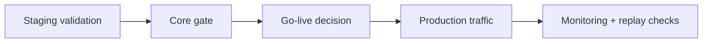

# Operations

This section is the production operations entry point.

## What you will learn

1. How to run go-live checks safely.
2. How to monitor critical production signals.
3. How to use replay in incident response and verification.

## What this section covers

1. Go-live readiness checks.
2. Monitoring and SLO guardrails.
3. Incident response with replay workflow.
4. Repeatable operational runbooks.
5. Release-safe rollback and evidence practices.

## Task-driven operating paths

1. Go live this week:
   start with [Go-live Checklist](go-live), then run [Monitoring and SLO](monitoring).
2. Investigate an incident now:
   start with [Incident Response and Replay](incident-response), then [Runbooks](runbooks).
3. Build evidence for change approval:
   use [Tutorial: Release Gate with Replay Evidence](/guide/tutorials/release-gate).

## Operating model

## Daily operator checklist

1. Verify health status and key service metrics.
2. Run policy sanity checks on a target scope.
3. Validate one replay chain from recent traffic.

## Weekly operator checklist

1. Run governance and evidence workflows.
2. Review SLO trend and incident noise.
3. Confirm rollback and drill readiness.

## How to navigate this section

Use the left sidebar to move between checklists, monitoring, incident response, and runbooks.
